# Getting Started With HaGL

HaGL consists of expressions of the generalized algebraic type `GLExpr d t`,
where `d` is a label which specifies where the expression will be computed
(its computational "domain") and `t` specifies the raw, underlying type that the
expression represents. The following table categorizes `GLExpr`s based on their domain:

| `GLExpr d t`              | Synonym       | Semantics                                                                |
| ------------------------- | ------------- | -------------------------------------------------------------------------|
| `GLExpr ConstDomain t`    | `ConstExpr t` | A constant of type `t` computed on the host CPU                          |
| `GLExpr HostDomain t`     | `HostExpr t`  | A potentially I/O-dependent value of type `t` computed on the host CPU   |
| `GLExpr VertexDomain t`   | `VertExpr t`  | A vertex variable of type `t` processed in a vertex shader on the GPU    |
| `GLExpr FragmentDomain t` | `FragExpr t`  | A fragment variable of type `t` processed in a fragment shader on the GPU| 

The underlying type `t` can be one of the following:

* A primitive type: `Float`, `Double`, `Int`, `UInt`, `Bool`
* A vector `Vec n t` with length $1 \leq n \leq 4$ and where `t` is a primitive type
* A matrix `Mat p q t` with $1 \leq p \leq 4$ rows and $1 \leq q \leq 4$ columns 
  and where `t` is either `Float` or `Double`

The `Vec` and `Mat` types are specific to HaGL but there is usually no
need to manipulate the values of such types directly.

HaGL provides different ways to construct and convert between specific `GLExpr`
types and at the same time allows them to be manipulated polymorphically through
the use of generic functions. 

For example, the following specifies an input vertex variable constructed from 
a stream of four vertices:

```
x :: VertExpr (Vec 4 Float)
x = vert [vec4 (-1) (-1) 0 1, vec4 (-1) 1 0 1, vec4 1 (-1) 0 1, vec4 1 1 0 1]
```

Suppose that we call a built-in function such as
```
length :: GLFloating t => GLExpr d (Vec n t) -> GLExpr d t 
```
on `x` to obtain 
```
y :: VertExpr Float
y = length x
```
This is well-typed because `Float` is an instance of
`GLFloating` and `VertExpr (Vec 4 Float)` matches the argument type `GLExpr d (Vec n t)`
of `length`. So from the type signature of `length`, we can tell that `y` is of 
type `VertExpr Float`. 

As `x` represents four vertices, `y` in turn represents four independent 
floating-point values corresponding to the length of each vertex, computed in
parallel in a vertex shader. So semantically `y` is equivalent to
```
y' :: VertExpr Float
y' = vert [length (vec4 (-1) (-1) 0 1), length (vec4 (-1) 1 0 1), ...]
```
However, `y` and `y'` will be computed in different ways since,
based on the type signature `[ConstExpr t] -> VertExpr t` of `vert`, we know 
that type of `length (vec4 (-1) (-1) 0 1)`, for instance, must be `ConstExpr Float`
and hence computed on the CPU. Thus we see that types, often implicitly inferred,
play a very important role in determining how a HaGL expression is computed.


## First Example

First, we import the module and enable some useful extensions:
```
{-# LANGUAGE GADTs GADTs -#}
{-# LANGUAGE GADTs DataKinds -#}
{-# LANGUAGE GADTs ViewPatterns -#}
{-# LANGUAGE GADTs FlexibleContexts -#}

import Graphics.HaGL
```

`GLExpr`s can be used to specify a `GLObj` which represents a drawable unit in
an OpenGL application. A `GLObj` is defined by a choice of a `PrimitiveMode`, 
which specifies how the vertices represented by its `position` field
are to be interpreted. For example, in the primitive mode `Triangles` every
three consecutive position vertices define the points of a triangle primitive. The
easiest way to specify such a `GLObj` is using Haskell's record syntax on the
pre-defined object `triangles`. The only fields we will consider in this guide are
`position :: VertExpr (Vec 4 Float)` and `color :: FragExpr (Vec 4 Float)`:
```
triangles :: GLObj
triangles { position = ..., color = ... }
```
Let us draw two blue triangles, as in the opening example in Ch. 1 of the 
*OpenGL Programming Guide*. To do so, we need to specify the 
[homogenous coordinates](https://en.wikipedia.org/wiki/Homogeneous_coordinates)
`vec4 x y z w` of two triangles; in the `Triangles` primitive mode, this means 
that the first three vertices represented by `position` specify the first 
triangle and the next three — the second:
```
pos :: VertExpr (Vec 4 Float) 
pos = vert 
    [vec4 (-0.9) (-0.9) 0 1, 
     vec4 0.85 (-0.9) 0 1, 
     vec4 (-0.9) 0.85 0 1, 
     vec4 0.9 (-0.85) 0 1, 
     vec4 0.9 0.9 0 1, 
     vec4 (-0.85) 0.9 0 1]
```
Here we are working in a clip coordinate system where all positions
satisfy $-1 \leq x/w, y/w, z/w \leq 1$ or are otherwise clipped.
Each of the two triangles will be colored in the same way, using the color blue:
```
blue :: FragExpr (Vec 4 Float)
blue = vert4 0 0 1 1
```
We can then define our desired object as
```
blueTriangles = triangles { position = pos, color = blue }
```
and readily draw it by issuing:
```
> drawGlut blueTriangles
```
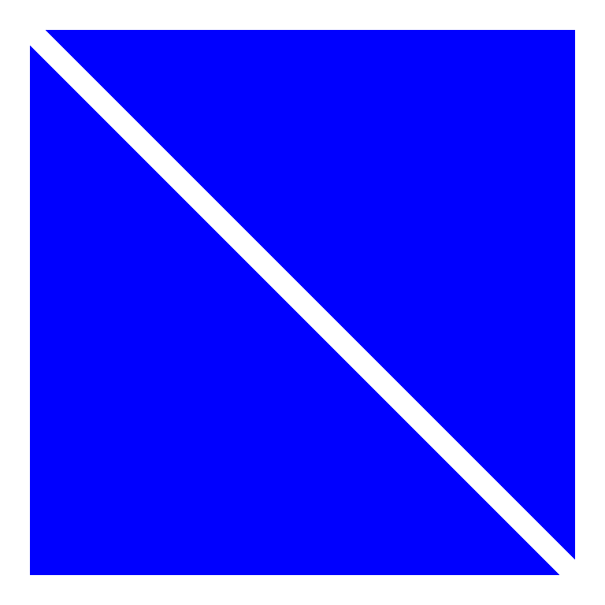

---
**TIP**

The examples in this page, often interactive, are most useful when run
locally and modified in different ways, often as a starting point for independent
experimentation. They are defined as identically named `GLObj`s (or generators
thereof) in the module `Graphics.HaGL.Examples`, whose source is in the 
[examples](examples) directory, and can be drawn using `draw` or convenience 
functions such as `drawGlut` (for instance from a GHCi session).

Note that the images on this page were produced by drawing on a non-default 
white background (by setting the `clearCol` field of `GlutOptions` passed to
`draw`).

---

To make this example more meaningful, let us try to color the fragments in a 
position-dependent way. We can achieve this using the `frag` function which takes 
in as input a vertex expression and outputs a fragment expression that represents 
an arbitrary interpolation of the input values at the vertices generating the 
corresponding primitive:

```
fpos :: FragExpr (Vec 4 Float)
fpos = frag pos
```

Now let's make the color vary as a function of the `x` coordinate of `pos`, 
using the function `mix` to produce a red-blue gradient:

```
-- normalize the x coordinate to lie in [0, 1]
s = 0.5 * (x_ fpos + 1)

redBlue = mix red blue (vec4 s s s s)

redBlueTriangles = triangles { position = pos, color = redBlue }
```

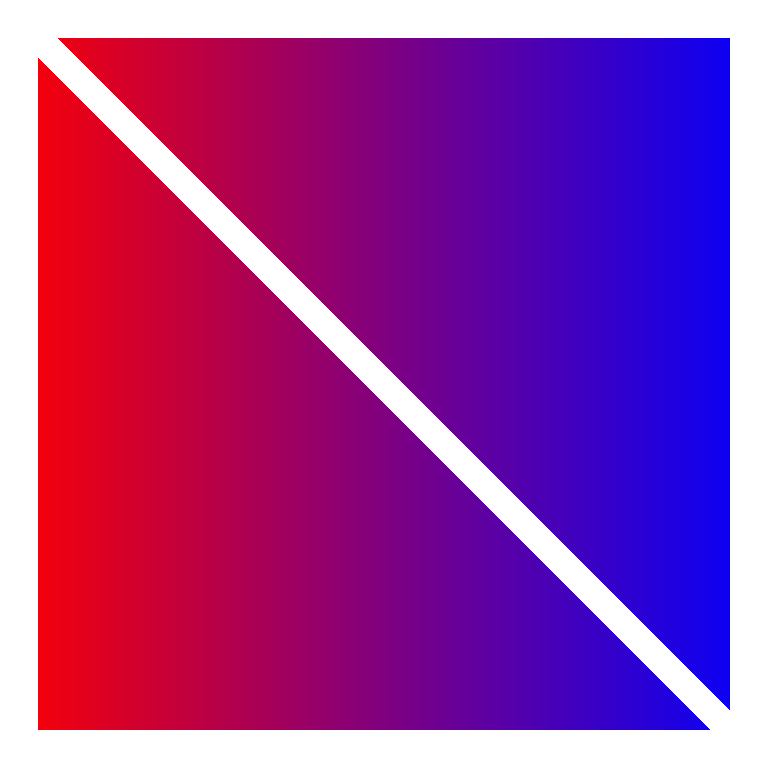


## Drawing Images

Fragment shaders are interesting in their own right, and producing interesting 
visual and animations by coloring a 2D image is an art in itself.

One approach we can take is one following the ideas in Ch. 7 of 
*The Fun of Programming* ("Functional images" by Conal Elliott), where an image 
is defined as a mapping from 2D points in the plane to a color (in RGBA space):

```
type ImagePos = FragExpr (Vec 2 Float)
type ImageColor = FragExpr (Vec 4 Float)
type Image = ImagePos -> ImageColor
```

Given an `Image` we can create a `GLObj` as follows:
```
fromImage :: Image -> GLObj
fromImage im = 
    let pos = vert 
            [vec4 (-1) (-1) 0 1, 
             vec4 (-1) 1 0 1, 
             vec4 1 (-1) 0 1, 
             vec4 1 1 0 1]
        fpos = frag quadPos
    in triangleStrip { position = pos, color = im fpos }
```
In the `TriangleStrip` primitive mode every sliding window of three vertices 
defines a triangle; in this case we use two triangles to draw a quad which we 
use as a canvas with endpoints `(-1, -1), (-1, 1), (1, 1), (1, -1)` we can
color by mapping an interior point `fpos` to `im fpos`.

We can now draw any `Image`:
```
blueCircle :: GLObj
blueCircle = fromImage $ \pos ->
    cast (length pos .<= 0.5) .# vec4 0 0 1 1
```

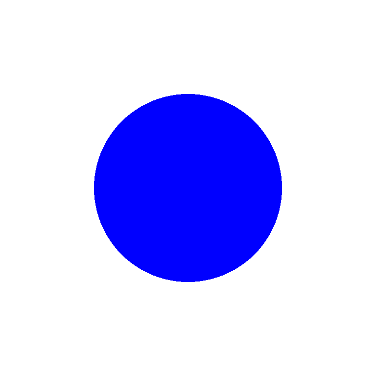

Note the `cast` from `FragExpr Bool` to `FragExpr Float`, as well as the use of 
the operator (.<) for comparing expressions of type `GLExpr d Bool` and the 
operator (.#) for scalar multiplication.

Suppose that we have two `Image`s and would like to combine them in some way;
this amounts to lifting an operator to the color co-domains of both images via helper
functions of the form:
```
liftToImage1 :: (ImageColor -> ImageColor) -> Image -> Image
liftToImage1 f im x = f (im x)

liftToImage2 :: (ImageColor -> ImageColor -> ImageColor) -> Image -> Image -> Image
liftToImage2 f im1 im2 x = f (im1 x) (im2 x)

...
```

For instance, we can define
```
bluePlusRedCircle :: GLObj
bluePlusRedCircle = fromImage $ liftToImage2 (+) blueCircIm redCircIm where
    blueCircIm pos = cast (length (pos + vec2 0.25 0) .<= 0.5) .# vec4 0 0 1 1
    redCircIm pos = cast (length (pos - vec2 0.25 0) .<= 0.5) .# vec4 1 0 0 1
```

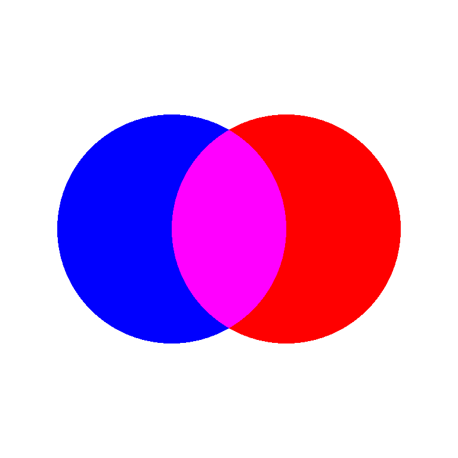

Note that one other way to combine images is to make use of their alpha component and `draw` multiple at once:

```
blueOverRedCircle :: [GLObj]
blueOverRedCircle = [redCircle, blueCircle] where
    blueCircle = circle (vec2 (-0.25) 0) (vec4 0 0 1 1)
    redCircle = circle (vec2 0.25 0) (vec4 1 0 0 1)
    circle center color = fromImage $ \pos ->
        cast (length (pos - center) .<= 0.5) .# color

-- a [GLObj] is also an instance of Drawable
> drawGlut blueOverRedCircle
```

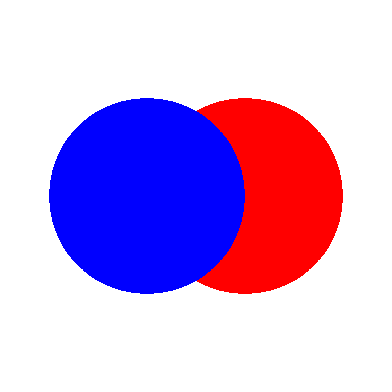

### Transformations of Images

A transformation of an image is simply a function that remaps its domain:

```
type ImageTransform = ImagePos -> ImagePos
```

For example `rotate ang` will rotate an image by `ang` radians:

```
rotate :: FragExpr Float -> ImageTransform
rotate ang pos@(decon -> (x, y)) = 
    let r = length pos
        theta = atan (y / x)
    in r .# vec2 (cos $ theta + ang) (sin $ theta + ang)
```

Here we've introduced the deconstruction operator `decon`, which combined with
view pattern syntax allows us to "pattern match" on a vector.

Let us apply this transformation on a simple checkboard image:

```
checkboardImage :: Image
checkboardImage (decon -> (x, y)) = c .# vec4 1 1 1 1 where
    c = cast $ (floor (10 * x) + floor (10 * y)) `mod` 2 .== 0

rotatedCheckboard :: FragExpr Float -> GLObj
rotatedCheckboard angle = fromImage $ checkboardImage . rotate angle

> drawGlut $ rotatedCheckboard (pi / 4)
```

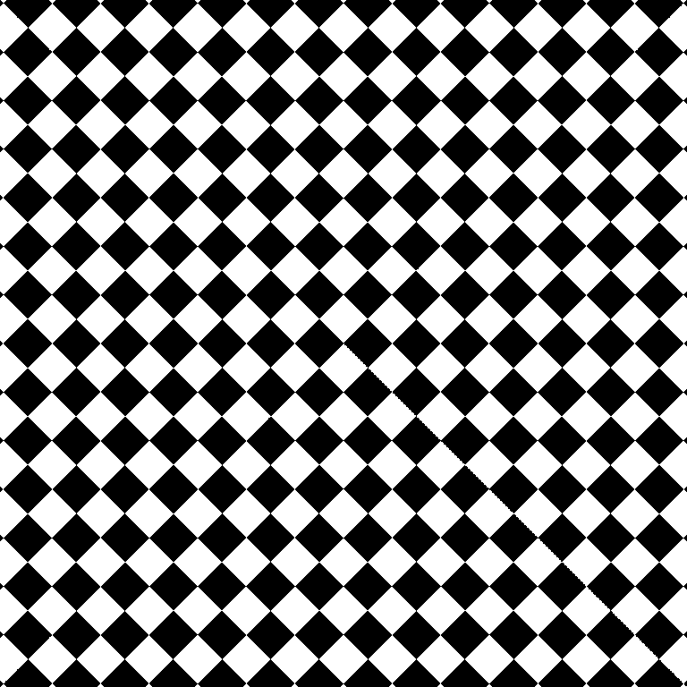

### Using Uniforms to Animate Images

Many times we need to compute a value on the CPU that will be the same across
all vertices or fragments. To this end, the `uniform` function takes in a `HostExpr` and produces an expression in an arbitrary domain:

```
uniform :: GLType t => HostExpr t -> GLExpr d t 
```

For example, in this expression, the value of `2 * 5` will be computed on the CPU,
whereas the multiplication of the resulting value `10` with the input vertices
will occur in a vertex shader:
```
x :: VertExpr Float
x = uniform (2 * 5) * vert [1, 2, 3] 
```

HaGL provides a few built-in `HostExpr`s for accessing the I/O state of the
current window being drawn such as `time`, `mouseX`, `mouseY`. This makes it
fairly simple to define interactive behaviour and animation. We can animate our
previous example by passing in `uniform time` as the input angle to `rotatedCheckboard`
instead of a fixed constant:

```
> drwGlut $ rotatedCheckboard (uniform time)
```

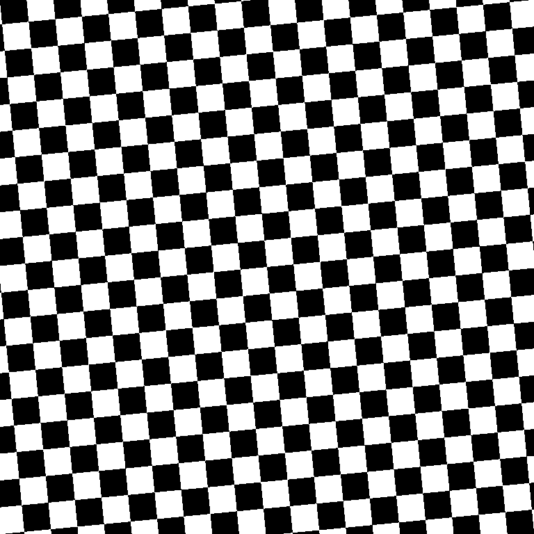

Here is a slightly more interesting example:

```
windingsPaths GLObj
windingsPaths = fromImage $ \(decon -> (x, y)) ->
    let curve x t = 0.2 * sin (x + 4 * t)
        distPlot y' = 
            step (y' - 0.03) y -
            step (y' + 0.03) y
        greenish = vec4 0.1 0.7 0.3 1 
        redish = vec4 0.7 0.1 0.1 1 
        bluish = vec4 0.1 0.1 0.7 1
    in distPlot (curve x t) .# greenish +
       distPlot (curve x (2 * t + 0.5)) .# redish +
       distPlot (curve x (0.5 * t - 0.5)) .# bluish
```

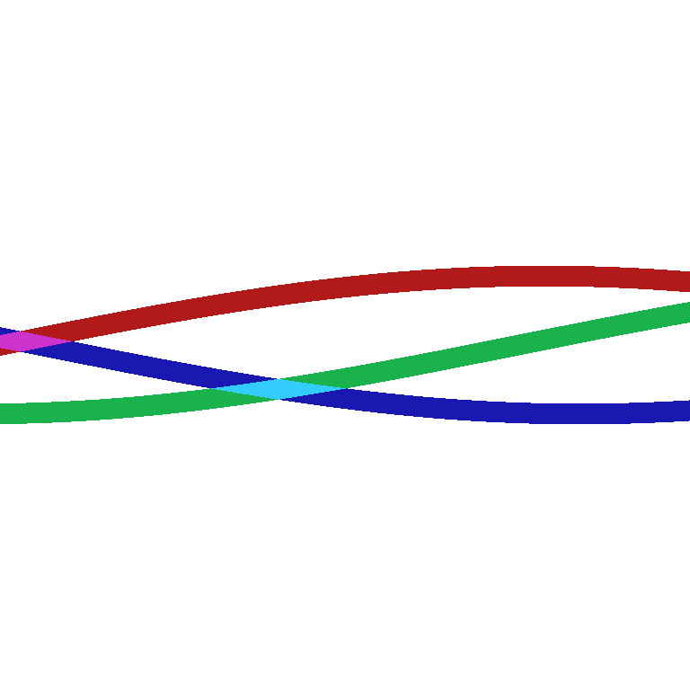

### More Fragment Shading

There are many interesting directions to explore with fragment shaders. 
With the right equations, we can even draw 3D objects, as in this 
[the `fragSphere` example](../examples/src/Graphics/HaGL/Examples/Images.hs):

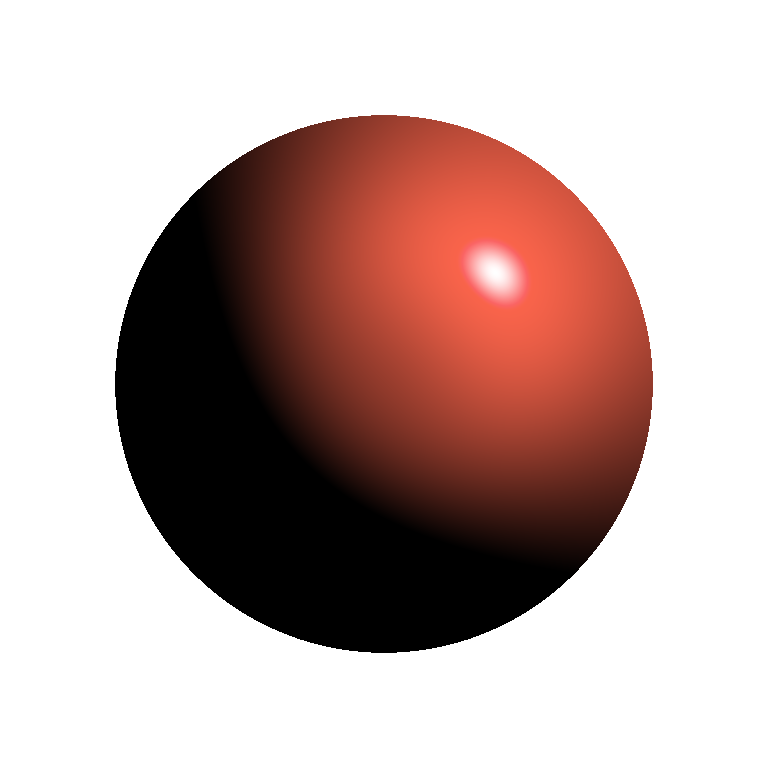

<!-- add an SDF example here !-->

The evolving HaGL library includes a small number of noise-generating 
functions such as `perlinNoise` and `fbm` (fractal Brownian motion). Given a 
seed `s` and a 3D coordinate `xyz`, `perlinNoise s (scale .* xyz)` returns a 
smoothly varying pseudorandom value in the range [-1, 1]:

```
noiseGrid :: GLObj
noiseGrid = fromImageInteractive $ \pos ->
    let xyz = app pos (uniform time / 200)
        nv = perlinNoise 1 (32 .# xyz)
        rgb = nv .# 0.5 + 0.5
    in app rgb 1
```

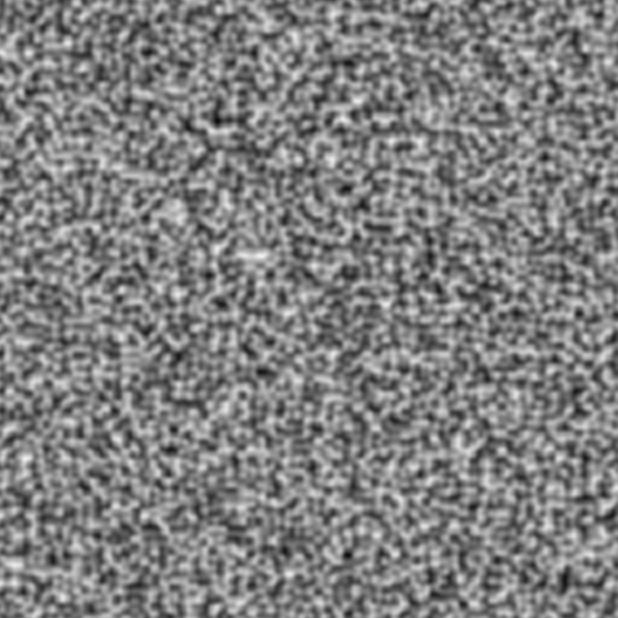

(The library provides `fromImageInteractive` as an alternative to `fromImage`,
 which additionally supports interactive panning and zooming of the 
 image. Also note the use of the expression `nv .# 0.5` as short for 
 `nv .# vec3 0.5 0.5 0.5` since vectors can be initialized from numeric
 literals in this manner.)

By combining appropriately scaled noise in various ways, we can create
procedurally generated content such as this terrain map:

```
procgen2DWorld :: GLObj
procgen2DWorld = fromImageInteractive $ \pos ->
    let perlin amp freq = amp * perlinNoise2D 1 (freq .* pos)
        tot = perlin 4 4 + perlin 2 8 + perlin 1 32
        rgb1 = (flip app) 1
    in rgb1 $ cond (tot .<= 0)  (vec3 0 0 1) $
              cond (tot .< 0.5) (vec3 1 1 0) $
                                (vec3 0 1 0)
```

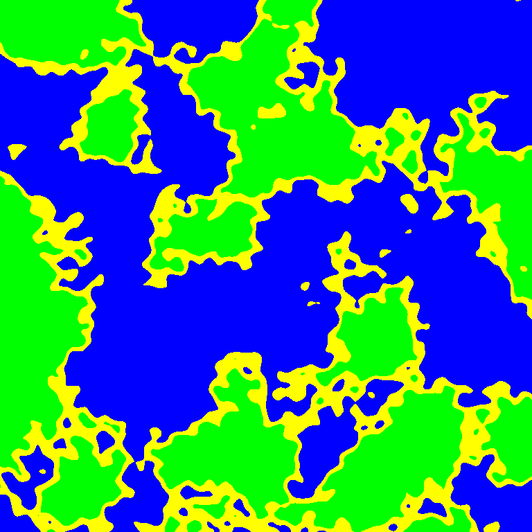


## Vertex Processing

So far we have shown how HaGL can be used to draw objects by means of operations 
at the `FragmentDomain` level that define colors at individual points of an image. 
In this section, we show how operations at the `VertexDomain` level can be used
to manipulate the underlying geometry in interesting ways.

### Three-dimensional Drawing

If we think of a 3D object as a mesh consisting of vertices and triangle faces, 
then one way to draw it is to use the `Triangles` primitive mode, where the we
specify the positions of all the triangles vertices via the `position` field
of the `GLObj` and specify the faces of each triangle via the `indices` field.
Every three consecutive indices determines the position of a triangle primitive.
Note that when we omitted the indices before, we were implicitly defining them as
```
    [0,1,2, 3,4,5, 6,7,8, ...]
```
but this is inadequate when vertices have to be shared.

To draw something like a cube we can therefore start by defining the vertices
and faces of the twelve triangles it's comprised of (two triangles for every 
face of the cube):

```
vertices :: [ConstExpr (Vec 4 Float)]
vertices =
    [vec4 1 1 1 1,
     vec4 (-1) 1 1 1,
     vec4 (-1) (-1) 1 1, 
     vec4 1 (-1) 1 1,
     vec4 1 (-1) (-1) 1, 
     vec4 1 1 (-1) 1, 
     vec4 (-1) 1 (-1) 1, 
     vec4 (-1) (-1) (-1) 1]

faces :: [ConstExpr UInt]
faces = [0,1,2, 0,2,3, 0,3,4, 0,4,5, 0,5,6, 0,6,1,
         1,6,7, 1,7,2, 7,4,3, 7,3,2, 4,7,6, 4,6,5]
```

The position of a vertex is then the expression

```
pos :: VertExpr (Vec 4 Float)
pos = vert vertices
```

Note that we defined `vertices` and hence also `pos` in terms of *world space*
coordinates; that is, our intention is to draw a cube with side length equal to 
two, centered at the origin of our world's coordinate system.

To transform `pos` to *view space* (or eye space), we need to define a
transformation matrix `view :: HostExpr` (assumed to lie in `HostDomain` since 
we normally expect it to be updated in some interactive manner). We can use
convenience functions defined in `Graphics.HaGL.Lib.Math` to create affine
transformation matrices, for instance `rotate`, which creates a rotation matrix
from a given axis and angle, and `translate`, which creates a translation matrix
from a given translation vector:
```
rotate :: _ => GLExpr d (Vec 3 t) -> GLExpr d t -> GLExpr d (Mat 4 4 t)
translate :: _ => GLExpr d (Vec 3 t) -> GLExpr d (Mat 4 4 t)
```
Let us define `view` to simulate a camera orbiting the cube around the line $x=y=z$
(with an orbital radius of five units):
```
view :: HostExpr (Mat 4 4 Float)
view = 
    let initialEye = vec3 0 0 5
        axis = normalize $ vec3 1 1 1
        angle = time
    in translate (-initialEye) .@ rotate axis angle
```
Transforming `pos` to view space, we obtain:
```
vpos :: VerteExpr (Vec 4 Float)
vpos = uniform view .@ pos
```

Finally, we need to project `vpos` to the *clip coordinates* suitable for
specifying the `position` field of a `GLObj`. `Graphics.HaGL.Lib.Math` provides 
the functions `perspective`, `perspective'`, and `orthogonal` for creating 
projection matrices. For instance, we can define `proj` in terms of some chosen
field of view angle (in the y direction), aspect, and near and far values:
```
proj :: HostExpr (Mat 4 4 Float)
proj = perspective (pi / 6) 1 1 10
```

Transforming `vpos` to clip space, we obtain
```
cpos :: VertExpr (Vec 4 Float)
cpos = uniform proj .@ vpos
```

Note that `cpos` is equivalent to the expression
```
(uniform proj .@ uniform view) .@ pos
```
where `unform proj` and `uniform view` are both of type `VertExpr (Mat 4 4 Float)`.
This means that the two matrices will be multiplied in the vertex shader, which
is not quite what we want since they do not depend on any vertex
and can thus be pre-computed on the CPU. We can instead define `cpos` in terms
of the equivalent but more efficient expression
```
uniform (proj .@ view) .@ pos
```

We are now ready to draw an animation of an orbit around a cube:
```
cube = triangles { indices = Just faces, position = pos, color = color }
drawGlut cube
```
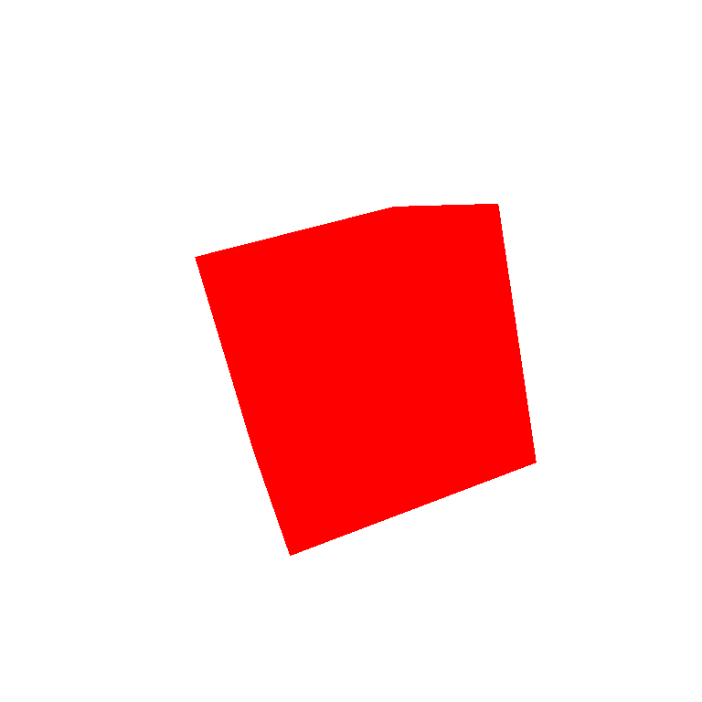

### Adding Interactivity

The function `interactiveView` defined in `Graphics.HaGL.Lib.Camera` creates a 
view that can be panned and zoomed by the user. So to convert the above example
to an interactive one, all need to do is modify our definition of `view` to be
`interactiveView initialEye` for some chosen position of `initialEye`.

### Drawing Particles

The `GLObj` `points` corresponds to the `Points` primitive mode, where each
input position specifies that of a single point. With the help of a few library
functions for pseudorandom number generation, we can use it to create simple
particle systems:

```
explosion :: GLObj
explosion = 
    let s = vert [vec2 i j | i <- [-30..30], j <- [-30..30]]
        speed = randFloat21 s ** 2
        pos = (uniform time * speed / 10) .# randDir s
        cpos = uniform (interactiveView $ vec3 0 0 1) .@ app pos 1
        col = mix (vec4 1 0 0 1) (vec4 1 1 0 1) (frag speed)
    in points { position = cpos, color = col }
```


### Drawing Curves and Surfaces

A loxodrome (or a spherical spiral) is a curve in 3D space given by the 
parametric equation
$$
(x, y, z) = \frac{1}{\sqrt{a^2 t^2}} \left( \cos t, \sin t ,- a t \right)
$$
for some constant. It can be drawn as a `lineStrip` where each position
specifies the next endpoint of a series of connected line segments:

```
loxodrome :: GLObj
loxodrome = let
    -- specify uniform grid of input vertices
    res = 10000
    u = vert [i / res | i <- [0..res]]

    -- transform vertices according to parametric equation
    t = 100 * (u - 0.5)  -- t ∈ [-50, 50]
    a = 0.1
    x = (0.7 / sqrt (1 + a * a * t * t)) .# vec3 (cos t) (-a * t) (sin t)

    -- apply camera transformation
    initialEye = vec3 0 0.5 5
    cpos = uniform (defaultProj .@ interactiveView initialEye) .@ app x 1

    -- use fancy colors
    red = vec3 0.8 0.2 0.2
    blue = vec3 0.2 0.2 0.8
    c = smoothstep red blue (frag u .# 1)

    -- animate time variable of the equation
    color = app c $ step (frag u) (uniform time / 5)

    in lineStrip { position = cpos, color = color }
```

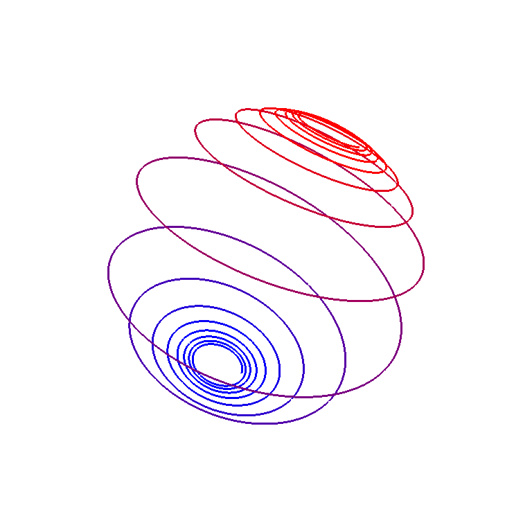

The HaGL library provides initial support for creating simple meshes or loading
them from OBJ files, where a mesh is represented by the data type
```
data Mesh = Mesh {
    meshVertices :: [ConstExpr (Vec 3 Float)],
    meshNormals :: [ConstExpr (Vec 3 Float)],
    meshFaces :: [ConstExpr UInt]
}
``` 

For example,

```
uvSphere :: ConstExpr Float -> ConstExpr Float -> (Mesh, FragExpr (Vec 2 Float))
```

takes in a resolution parameter $res$ and radius $r$, and creates a `Mesh` for
a sphere by mapping $u \in [0 \times res], v \in [0 \times res]$ to the vertices
$$
    (x, y, z) = r (\cos u \sin v, \sin u \sin v, \cos v)
$$
in a [similar way](../lib/src/Graphics/HaGL/Lib/Objects3D.hs) as was done in the
previous example. 
In addition to the resulting mesh, it returns a `FragExpr` for a point on the
sphere in terms of the $(u, v)$ coordinates so that we can map a texture to the 
sphere by coloring its [parametric $uv$-plane](https://en.wikipedia.org/wiki/UV_mapping), 
as in the following example:
```
checkeredSphere :: GLObj
checkeredSphere = let
    ((Mesh verts _ inds), (decon -> (u,v))) = uvSphere 32 1
    pos = vert verts

    view = interactiveView (vec3 0 0 5)
    cpos = uniform (defaultProj .@ view) .@ app pos 1

    c = (floor u + floor v) `mod` 2 .# 1

    in triangles { 
        indices = Just inds, 
        position = cpos, 
        color = app c 1 }
```

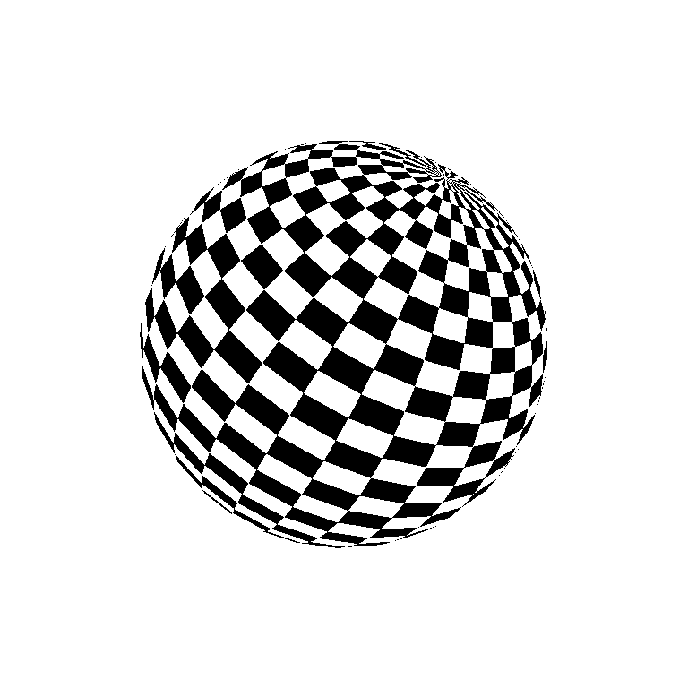

### Shading

The [Blinn-Phong shading model](https://en.wikipedia.org/wiki/Blinn%E2%80%93Phong_reflection_model) 
can be used to color a given
point on a surface by modelling the properties of light hitting that
point. It can be implemented in HaGL as the function taking `FragExpr`-typed parameters

* $ka$, $kd$, $ks$ for the ambient, diffuse, and specular
colors, respectively,
* the scalar specular exponent $pp$,
* the normal $n$ at the point,
* the unit direction $e$ from the point to the eye, 
* the unit light direction $l$:
```
blinnPhong ka kd ks pp n e l = app color 1 where
    h = normalize (e + l)
    color = max 0.0 (dot n l) .# kd + 
            (max 0.0 (dot n h) ** pp) .# ks + 
            0.4 .# ka
```  

Applying this to the same `uvSphere`:
```
shadedSphere :: GLObj
shadedSphere = let
    ((Mesh verts norms inds), _) = uvSphere 32 1

    pos = vert verts
    norm = vert norms

    view = interactiveView (vec3 0 0 5)
    eyePos = uniform $ eyeFromView view
    cpos = uniform (defaultProj .@ view) .@ app pos 1

    kd = vec3 0.8 0.6 0.6
    ks = vec3 1 1 1
    ka = vec3 0.2 0.8 0.5
    pp = 1000
    t = uniform time
    xyRotLight off = vec3 (off * cos t) 0 (off * sin t)
    l = normalize $ (xyRotLight 5) - p
    col = blinnPhong kd ks ka pp norm eyePos l
    
    in triangles { 
        indices = Just inds, 
        position = cpos, 
        color = col }
```

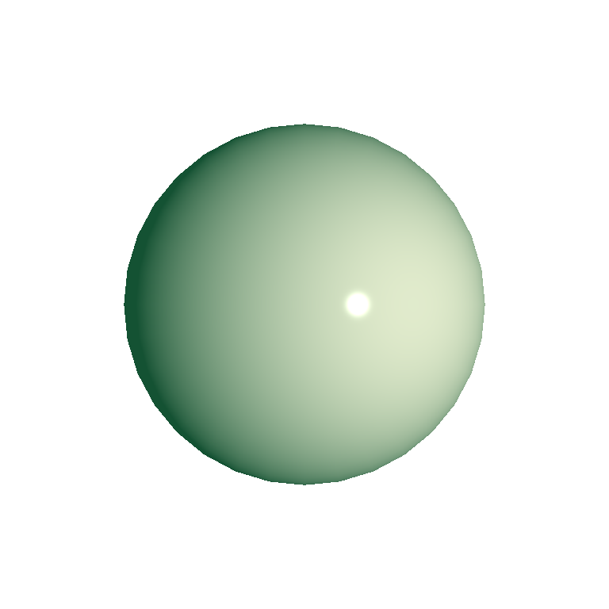

We can apply the same shading model to 
[arbitrary meshes](../src/Graphics/HaGL/Lib/Mesh.hs) and 
[parameteric surfaces](../examples/src/Graphics/HaGL/Examples/Manifolds.hs):

<p float="left">
    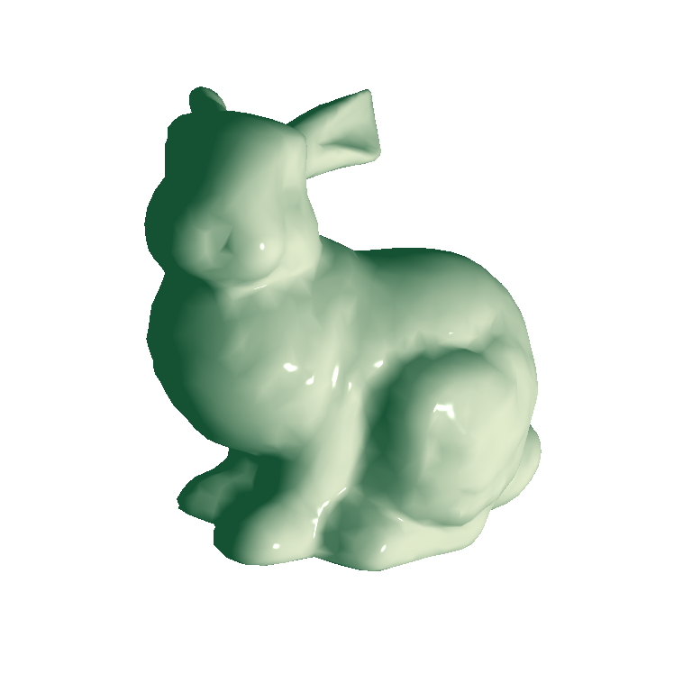
    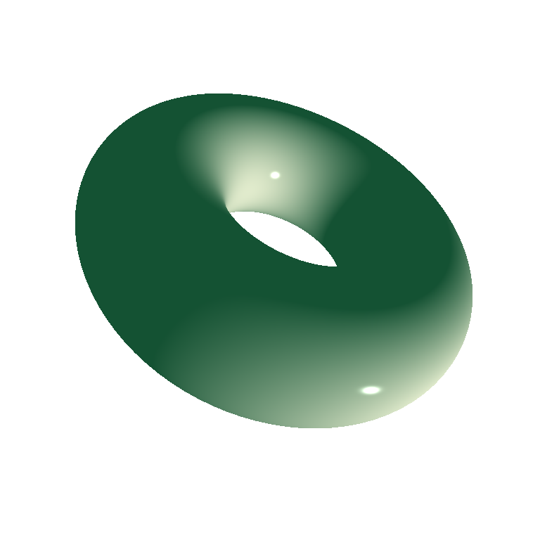
</p>

By using noise to perturb the normals of the sphere and produce a procedurally
generated texture similar to the 2D one we previously saw, we can use the same
shading model to produce [planet-like surfaces](../examples/src/Graphics/HaGL/Examples/Spheres.hs):

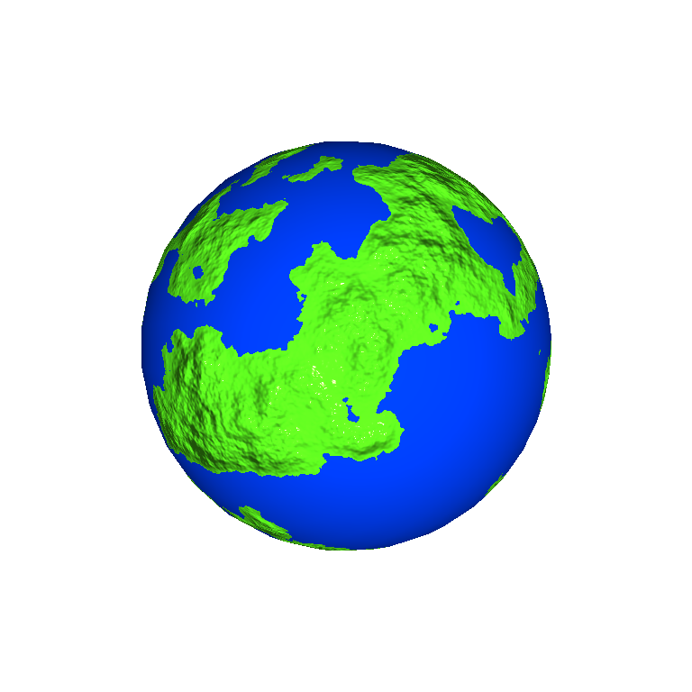


## Time-evolving State Using `prec`

<!-- TODO: this may be too formal for this guide,
     consider moving parts of it to documentation !-->

Though we have seen how to create animations by making expressions depend
on `time`, this approach will not suffice if we want to keep track of some
state that evolves as a function of itself, for example, to
simulate and visualize a physical process. For this reason, HaGL provides the
operator
```
prec ::  GLType t => HostExpr t -> HostExpr t -> HostExpr t
```
which loosely corresponds to the function $prec$ defined as follows:

If $x_0, x_1, \ldots, x_t$ represent the values of expression $x$
at discrete moments of time, then
$$prec(x_0, x)_t = \begin{cases} x_0, & t = 0 \\ x_{t-1}, & t > 0 \end{cases}$$

In other words, `prec x0 x` holds the value of `x` as it was a moment of time
ago or $x_0$ if this is first such moment of time. In the case of a backend like GLUT, 
the discrete points of time correspond to updates in the main loop.
For example, `prec 0 time` corresponds to the value of `time` one time-step ago.

The main usefulness of `prec` lies in its ability to create self-referential
expressions and thereby define sequences in terms of recurrence relations. For
example, the expression
```
x :: HostExpr Int
x = prec 0 (x + 1)
```
corresponds to the sequence $x_0 = 0$, $x_t = x_{t-1} + 1$, equal 
to $x_t = t$.

Likewise the following are two equivalent ways to define the Fibonacci sequence:
```
fibSeq, fibSeq' :: HostExpr Int
fibSeq = prec 0 (fibSeq + prec 1 fibSeq)
fibSeq' = prec 0 fibSeq' + prec 0 (prec 1 fibSeq')
```

### Drawing Numerical Simulations

Let us bring the `prec` operator into a more concrete perspective by showing
how it can be used to simulate the motion of a pendulum on the CPU (using the
Euler method for numerical integration).

Given a damping factor $\alpha$, mass $m$ and gravitational constant $g$, 
the angle $\theta$ of the pendulum relative to its pivot follows the 
following Euler equations

$$ 
\begin{aligned} 
\theta'_{t+1} &= \alpha \theta'_t - mg \sin \theta_t dt \\
\theta_{t+1} &= \theta_{t} + \theta'_{t} dt,
\end{aligned}
$$

and its position equals

$$ \frac{1}{2}\left(\sin \theta, - \cos \theta\right).$$

With arbitrary choices for the constants, this translates to the following
HaGL expression
```
pendPos :: HostExpr Float
pendPos = 
    let damping = 0.9999
        dt = time - prec 0 time
        theta' = prec 0 (damping * theta' - 10 * sin theta * dt)
        theta = prec (pi / 3) (theta + theta' * dt)
    in vec2 (sin theta / 2) (- cos theta / 2)
```

The visualization itself can then be produced by drawing circles at positions
relative to `pendPos`:
```
pendulum :: GLObj
pendulum = fromImage $ \pos ->
    let circleAt pos off r col = cast (length (pos - off) .<= r) .# col
    in circleAt pos (vec2 0 0) 0.01 (vec4 1 1 1 1) 
        + circleAt pos (0.25 * x) 0.01 (vec4 0 0 1 1) 
        + circleAt pos (0.50 * x) 0.01 (vec4 0 0 1 1) 
        + circleAt pos (0.75 * x) 0.01 (vec4 0 0 1 1)
        + circleAt pos x 0.04 (vec4 1 0 0 1) 
```

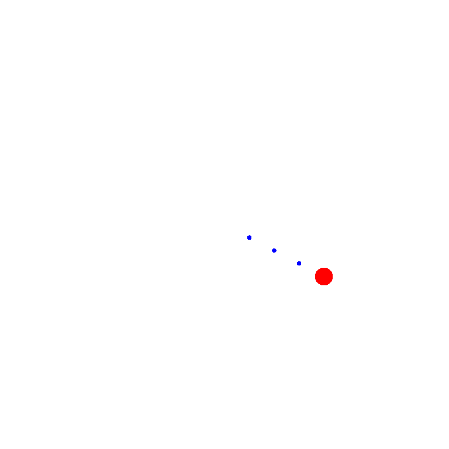

### Saving History

By plugging in the right equations, we can even simulate a double pendulum,
defining expressions for the positions of the inner and outer pendulum:
```
doublePendPos :: (HostExpr (Vec 2 Float), HostExpr (Vec 2 Float))
```
In this case, it would also be interesting to visualize its path through time.
We can draw the list of objects
```
doublePendulum :: GLObj
doublePendulum = [path doublePendPos, circles doublePendPos]
``` 

where `circles` is defined in terms of `doublePendPos` a similar way to how we 
defined `pendulum` in terms of `pendPos`. As for `path`, we can define it as a
`lines` primitive, but we somehow need to keep track of the past positions of
the outer pendulum throughout time. One possible solution is to (ab)use the 
`prec` operator.

Note that a consequence of the definition of $prec$ is that

$$prec^{(n)}(x_0, x)_t = \begin{cases} x_0, & t < n \\ x_{t-n}, & t \geq n \end{cases}$$
where $prec^{(n)}$ corresponds to the Haskell function
```
\x0 x -> iterate (prec x0) x !! n
```

So if `x2` is the position of the outer pendulum, the array `x2Seq` storing the 
values
```
    x2, prec x2 x2, prec x2 (prec x2 x2), ...
```
and defined as
```
    x2Seq = array $ take pathLength $ iterate (prec x2) x2
```
captures the values of `x2` throughout the past `pathLength` points of time, from
most to least recent (with the least recent value filling up any undefined
portion of the array).
We can now define `path` as follows:
```
path :: (HostExpr (Vec 2 Float), HostExpr (Vec 2 Float)) -> GLObj
path (_, x2) = 
    let pathLength :: Num a => a
        pathLength = 1500

        x2Seq = array $ take pathLength $ iterate (prec x2) x2
        i = vert [0..(pathLength - 1)]
        xy = uniform x2Seq .! i
        pos = xy $- vec2 0 1

        fade = frag $ cast i / pathLength
        color = vec4 0 0 0 (1 - fade)
    in lineStrip { position = pos, color = color }
```

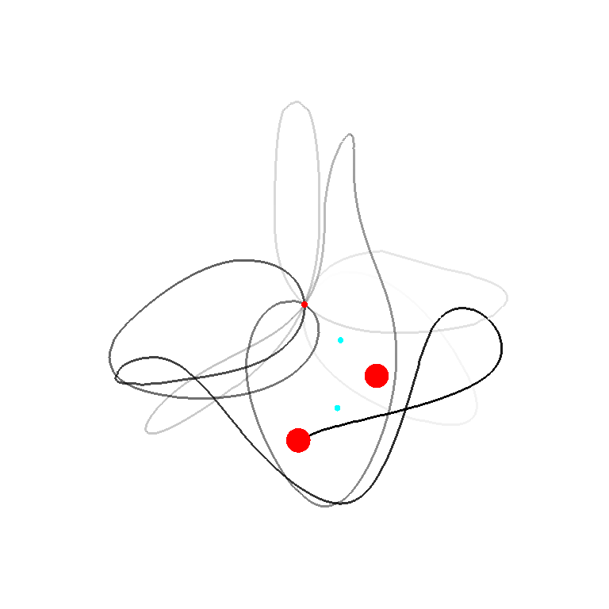

The full source of the simulation can be found in the definition of `doublePendulum` in
[Graphics.HaGL.Examples.Simulations](../examples/src/Graphics/HaGL/Examples/Images.hs).

## Lifting Functions to Shaders

We have defined several functions acting on `GLExpr`s throughout this overview.
Here is a simple example of such a function:
```
double :: GLExpr d Float -> GLExpr d Float
double x = 2 * x
```

Every function call `double x` will be expanded to
to the expression `2 * x`, should its value ever be needed. In most cases this
is not an issue because GLSL inlines functions anyways. 

Suppose however, that
we would like to carry out an arbitrary computation that depends on the value
of a shader variable and cannot easily be expressed as a composition of 
built-in functions. For example, to draw the Mandelbrot set, we need to
iterate a function a certain number of times on the value of a `FragExpr`
representing a given fragment (pixel). In GLSL, we could write a loop; the 
Haskell equivalent would be to write a tail-recursive function of the form

```
f x1 x2 ... = cond c b (f y1 y2 ...)
```
where none of the expressions `c`, `b` `y1`, `y2`, ... depend on `f`. In general, `c`
is the condition that checks for the base case, `b` is the expression for
the base case, and the `y1`, `y2`, ..., are state updates expressed in terms
of `x1`, `x2`, ... .

For instance, the function `mand'` defined as
```
mand' :: FragExpr (Vec 2 Float) -> FragExpr (Vec 2 Float) -> FragExpr Float -> FragExpr Float
mand' pos0@(decon -> (x0, y0)) (decon -> (x, y)) n =
    cond (n .== 0 .|| ((x * x + y * y) .> 4)) n $
        mand pos0 (vec2 (x * x - y * y + x0) (2 * x * y + y0)) (n - 1)
```
is such that 
```
mand (vec x0 y0) (vec2 0 0) 50
```
counts the number of iterations $n$, up to a maximum of 50, it takes for
$$ 
\begin{aligned} 
z_0 &= 0 \\
z_{n+1} &= z_n + (x + iy)
\end{aligned}
$$
to exceed a magnitude of 2, thus calculating an escape time that can be used to
color the pixel $(x_0,y_0)$ in a way that visualizes the Mandelbrot set.

However if we were to call `mand` directly, the
evaluation of such call would produce an infinite expression tree, which would 
lead to a crash or space leak. Instead we lift the 3-argument Haskell function 
`mand'` to a shader-level function `mand` using the higher-order function
`glFunc3`:
```
mand :: FragExpr (Vec 2 Float) -> FragExpr (Vec 2 Float) -> FragExpr Int -> FragExpr Int
mand = glFunc3 mand'
```

Note that `mand` has the same type signature as `mand'`. However, by using
`glFunc3`, we have explicitly declared that it is to be synthesized into a
shader function at the domain of its return type (`FragmentDomain`).

With `mand` now defined, drawing the Mandelbrot set is simple:
```
mandelbrot :: GLObj
mandelbrot = fromImageInteractive $ \pos ->
    rgb1 $ mand pos pos 50 .# 0.02
```

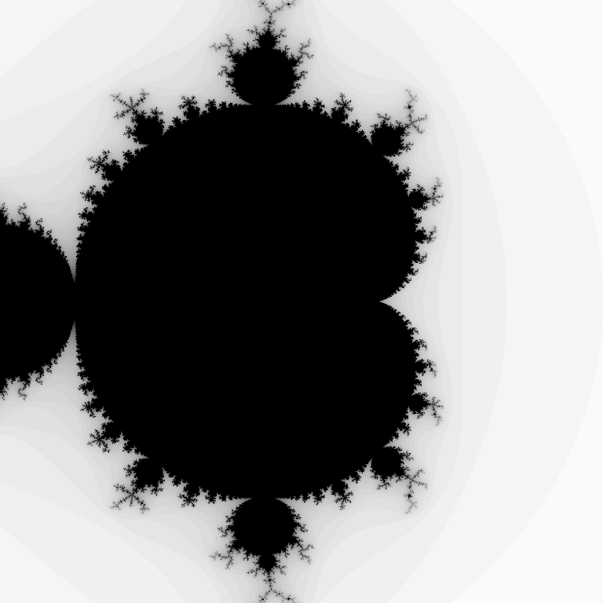

Non-recursive $n$-ary functions as well as tail-recursive ones of the form 
above can be lifted to shader-level functions using the family of higher-order 
functions `glFunc`*n*. Unfortunately, because GLSL does not support
recursive functions, tail-recursion of the form defined above is the only type
of recursion allowable in functions passed to `glFunc`*n*, as this corresponds 
to the class of functions which can be synthesized into a loop. Attempting
to use more general types of recursion will result in an exception being 
thrown.

### More Noise

We can use HaGL to generate noise in creative ways, following the ideas in
[Chapter 13 of *The Book of Shaders*](https://thebookofshaders.com/13/).

The implementation of the  library function `perlinNoise` that we 
used earlier is also implemented in terms of `glFunc`*n*, as is the
function `fbm` for generating 
[fractal Brownian motion](https://en.wikipedia.org/wiki/Fractional_Brownian_motion):
```
fbm :: GLExpr d Int -> GLExpr d Int -> GLExpr d (Vec 3 Float) -> GLExpr d Float
fbm seed n xyz = f 0 0 1 1 where
    f = glFunc4 $ \i t a k -> cond (i .== n) t $
        f (i + 1) (t + a * perlinNoise seed (k .# xyz)) (0.5 * a) (2 * k)
```
`fbm` caclulates the sum

$$\sum_{i=0}^{n} \frac{1}{2^i} \texttt{perlinNoise}(seed, 2^i (x,y,z))$$
which combines suitably scaled amounts of continuous noise in a 
fractal-like fashion:

```
fractalNoiseGrid :: GLObj
fractalNoiseGrid = fromImageInteractive $ \pos ->
    let xyz = app pos (uniform time / 10)
        nv = fbm 1 20 xyz .# 0.5 + 0.5 
    in rgb1 nv
```

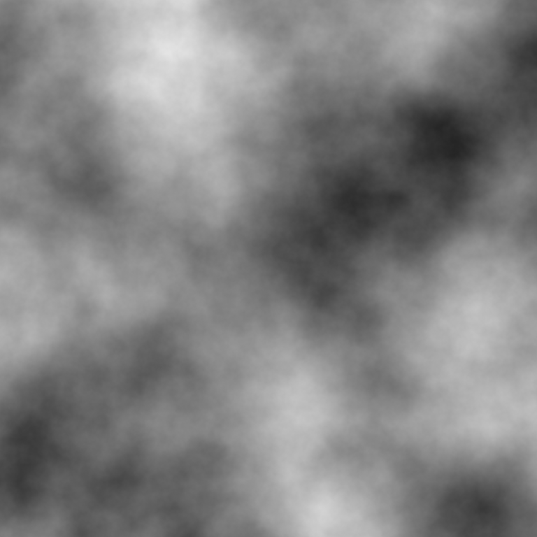

If we use `fbm` not only to generate noisy variations of colour but also to
randomly vary the underlying 2D domain, we can produce visualizations like:
```
warpedNoiseGrid :: GLObj
warpedNoiseGrid = fromImageInteractive $ \pos ->
    let t = uniform time
        off = vec2 
            (fbm 1 2 (app pos (t / 10 + 2))) 
            (fbm 1 2 (app pos (t / 10 + 3)))
        xyz = app (pos + off) (uniform time / 10)
        nv = fbm 1 2 xyz .# 0.5 + 0.5
    in mix (vec4 0.1 0.3 0.3 1) (vec4 1 1 1 1) (rgb1 nv)
```

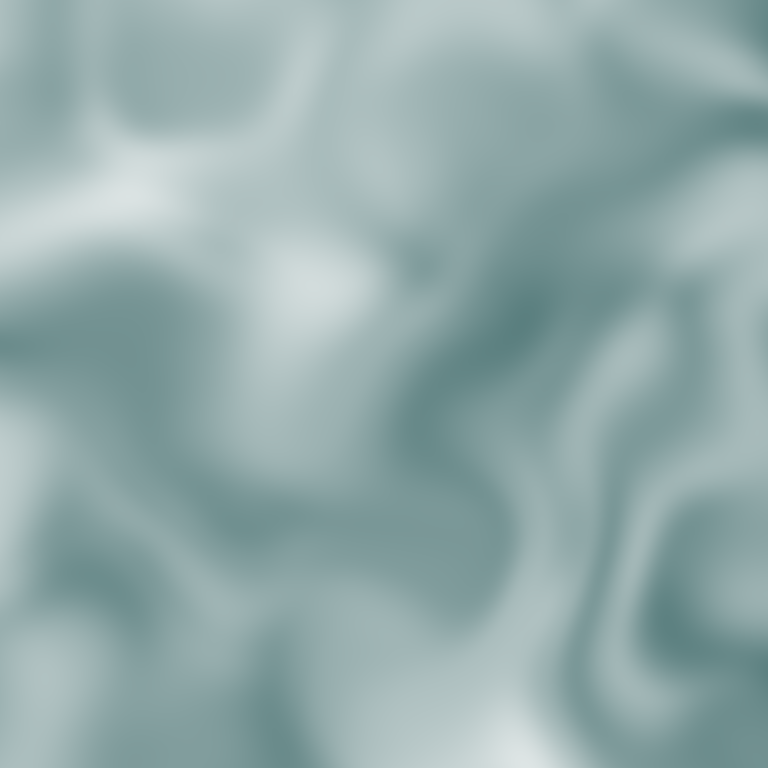

<!-- TODO: using glLift to lift functions that act on raw types --!>